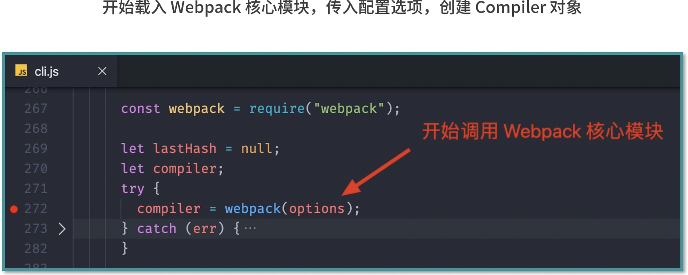

### 进度

#### 06节

webpack-newest-打包原理-工作原理-make阶段


### css loader

打包后在bundle.js文件中

``` js
var ___CSS_LOADER_EXPORT___ = _node_modules_css_loader_dist_runtime_api_js__WEBPACK_IMPORTED_MODULE_0___default()(function(i){return i[1]});
// Module
___CSS_LOADER_EXPORT___.push([module.i, "body {\n    margin: 0 auto;\n    padding: 0 20px;\n    max-width: 800px;\n    background: #f4f8fb;\n}\n  ", ""]);
// Exports
/* harmony default export */ __webpack_exports__["a"] = (___CSS_LOADER_EXPORT___);
```

### 
bundle中会生成console.log("hello loader ~") js代码


### htmlwebpackplugin

webpack.config.js

```
  plugins: [
    new CleanWebpackPlugin(),
    new HtmlWebpackPlugin({
      title: 'Webpack Plugin Sample111',
      // meta: {
      //   viewport: 'width=device-width'
      // }
      template: './src/index.html'
    }),
```

自定义title

index.html

```
<!DOCTYPE html>
<html lang="en">
<head>
  <meta charset="UTF-8">
  <meta name="viewport" content="width=device-width, initial-scale=1.0">
  <meta http-equiv="X-UA-Compatible" content="ie=edge">
  <title><%= htmlWebpackPlugin.options.title %></title>
</head>
```

#### 多页面

多入口打包

再new 一次 HtmlWebpackPlugin


### 插件

插件都是通过往webpack生命周期的钩子函数中去挂载一些任务函数去实现的。


webpack为每个工作环节都预留合适的钩子，拓展时只需要找到合适的时机去做

AOP 切面编程 

```js
// ./remove-comments-plugin.js
// 所以我们这里定义一个 RemoveCommentsPlugin 类型，然后在这个类型中定义一个 apply 方法，这个方法会在 Webpack 启动时被调用，它接收一个 compiler 对象参数，这个对象是 Webpack 工作过程中最核心的对象，里面包含了我们此次构建的所有配置信息，我们就是通过这个对象去注册钩子函数，具体代码如下：
class RemoveCommentsPlugin {

    apply (compiler) {
  
      console.log('RemoveCommentsPlugin 启动')
  
      // compiler => 包含了我们此次构建的所有配置信息
      // emit 即将向输出目录输出文件时执行
      compiler.hooks.emit.tap('RemoveCommentsPlugin', compilation => {
        // compilation => 可以理解为此次打包的上下文
        for (const name in compilation.assets) {
          console.log(name) // 这里会输出文件名称：bundle.js index.html
            // console.log(compilation.assets[name].source()) // 输出文件内容

            if (name.endsWith('.js')) {
                const contents = compilation.assets[name].source()
                const noComments = contents.replace(/\/\*{2,}\/\s?/g, '')
                compilation.assets[name] = {
                  source: () => noComments,
                  size: () => noComments.length
                }
            }
        }
      })
    }
  
}

module.exports = RemoveCommentsPlugin;
```

### loader和plugin区别

通过Loader处理特殊类型资源的加载，例如加载样式、图片 

通过Plugin实现各种自动化的构建任务，例如自动压缩、自动发布


### webpack工作原理

1。Webpack CLI启动打包流程
2。载入webpack核心模块，创建Compiler对象
3。使用Compiler对象开始编译整个项目
4。从入口文件开始，解析模块依赖，形成依赖关系树
5。递归依赖树，将每个模块交给对应的Loader处理
6。合并Loader处理完的结果，将打包结果输出到dist目录


#### Webpack CLI

作用就是将CLI参数和Nebpack配置文件中的配置整合
得到一个完整的配置对象

开始载入Nebpack核心模块，传入配置选项，创建Compiler对象,




#### webpack配置支持传入数组


