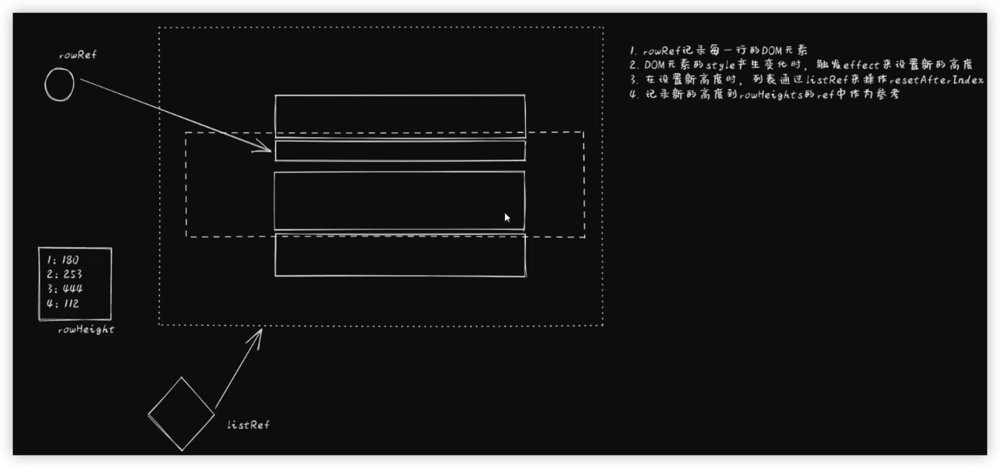

react-window

见： react-window.md

[虚拟列表-思维导图-ProcessOn](https://www.processon.com/mindmap/641c5b22314bb554fea08aa4)


https://react-window.vercel.app/#/examples/list/fixed-size

参考：
https://www.codeleading.com/article/83464600958/

## 教程

[【前端技能提升】用react-window实现省内存的呈现大量数据列表_哔哩哔哩_bilibili](https://www.bilibili.com/video/BV1G14y1L76U/?spm_id_from=333.788.recommend_more_video.2&vd_source=abb66f1f7d240b0556df3816424c3d88)


[useVirtualList - ahooks 3.0](https://ahooks.js.org/zh-CN/hooks/use-virtual-list/)

#### 不定高时




切新分支 

切master

git tag 1.0.0

git merge 新分支 --no-ff


9分28 TODO

[【前端技能提升】react-window 应用window的滚动条 虚拟列表的应用_哔哩哔哩_bilibili](https://www.bilibili.com/video/BV1XG411A7NA/?spm_id_from=333.999.0.0&vd_source=abb66f1f7d240b0556df3816424c3d88)


## react-window-infinite-loader

分批次请求要加载的数据

[bvaughn/react-window-infinite-loader: InfiniteLoader component inspired by react-virtualized but for use with react-window (github.com)](https://github.com/bvaughn/react-window-infinite-loader)


[在线预览 - CodeSandbox](https://codesandbox.io/s/x70ly749rq?file=/src/App.js)

```jsx
const itemCount = 1000;

<InfiniteLoader
  isItemLoaded={isItemLoaded}
  itemCount={itemCount}
  loadMoreItems={loadMoreItems}
>
  {({ onItemsRendered, ref }) => (
    <FixedSizeList
      itemCount={itemCount}
      onItemsRendered={onItemsRendered}
      ref={ref}
      {...otherListProps}
    />
  )}
</InfiniteLoader>
```

### api

| Name               | Type                                                         | Description                                                  |      |
| ------------------ | ------------------------------------------------------------ | ------------------------------------------------------------ | ---- |
| `children`         | `({ onItemsRendered: Function, ref: React$Ref }) => React$Node` | Render prop. See below for example usage.                    |      |
| `isItemLoaded`     | `(index: number) => boolean`                                 | 负责记录每一项是否加载完成的方法                             |      |
| `itemCount`        | `number`                                                     | 列表中的项目数（或预期）                                     |      |
| `loadMoreItems`    | `(startIndex: number, stopIndex: number) => Promise<void>`   | 翻页时返回promise的回调，用于请求下一页                      |      |
| `minimumBatchSize` | `?number`                                                    | Minimum number of rows to be loaded at a time; defaults to 10. This property can be used to batch requests to reduce HTTP requests. | TODO |
| `threshold`        | `?number`                                                    | Threshold at which to pre-fetch data; defaults to 15. A threshold of 15 means that data will start loading when a user scrolls within 15 rows. | TODO |

### code示例

```jsx
function ExampleWrapper({
 // 是否还有下一页，根据最近一次的API请求获得
  hasNextPage,
	// boolean, 用于指示是否正在加载下一页数据
  isNextPageLoading,
  // 已经加载过的items数组
  items,
  // 回调函数，负责加载下一页
  loadNextPage
}) {
  // 如果存在下一页则增加一行 显示loading
  const itemCount = hasNextPage ? items.length + 1 : items.length;
	// 加载下一页的方法，loading时为空函数
  const loadMoreItems = isNextPageLoading ? () => {} : loadNextPage;
  // 每一项是否加载完（不包含loading)，1、没有下一页时， 2、当前索引小于items长度
  const isItemLoaded = index => !hasNextPage || index < items.length;

  // 渲染每一项或loading
  const Item = ({ index, style }) => {
    let content;
    if (!isItemLoaded(index)) {
      content = "Loading...";
    } else {
      content = items[index].name;
    }

    return <div style={style}>{content}</div>;
  };

  return (
    <InfiniteLoader
      isItemLoaded={isItemLoaded}
      itemCount={itemCount}
      loadMoreItems={loadMoreItems}
    >
      {({ onItemsRendered, ref }) => (
        <FixedSizeList
          itemCount={itemCount}
          onItemsRendered={onItemsRendered}
          ref={ref}
          {...props}
        >
          {Item}
        </FixedSizeList>
      )}
    </InfiniteLoader>
  );
}
```

### Advanced usage

Some use cases require cached items to be reset. For example, after a list has been sorted, previously cached items may be invalid. You can let `InfiniteLoader` know that it needs to reload cached items by calling the `resetloadMoreItemsCache` method.

```jsx
function ExampleWrapper({
  // ...
  sortOrder,
}) {
  // We create a reference for the InfiniteLoader
  const infiniteLoaderRef = useRef(null);
  const hasMountedRef = useRef(false);

  // Each time the sort prop changed we called the method resetloadMoreItemsCache to clear the cache
  useEffect(() => {
    // We only need to reset cached items when "sortOrder" changes.
    // This effect will run on mount too; there's no need to reset in that case.
    if (hasMountedRef.current) {
      if (infiniteLoaderRef.current) {
        infiniteLoaderRef.current.resetloadMoreItemsCache();
      }
    }
    hasMountedRef.current = true;
  }, [sortOrder]);
  
  // ...

  // We passed down the ref to the InfiniteLoader component
  return (
    <InfiniteLoader
      ref={infiniteLoaderRef}
      isItemLoaded={isItemLoaded}
      itemCount={itemCount}
      loadMoreItems={loadMoreItems}
    >
      {({ onItemsRendered, ref }) => (
        // ...
      )}
    </InfiniteLoader>
  );
}
```

### 参考

[使用 react-window 虚拟化大型列表 (web.dev)](https://web.dev/virtualize-long-lists-react-window/#滚动时延迟加载)

## react-virtualized-auto-sizer

高阶组件（会自动调整列表的宽高，使其100%填充父容器）

[API文档  ](https://github.com/bvaughn/react-virtualized/blob/master/docs/AutoSizer.md)

略，没啥东西https://github.com/bvaughn/react-virtualized-auto-sizer 

```jsx
import React from 'react';
import ReactDOM from 'react-dom';
import {AutoSizer, List} from 'react-virtualized';
import 'react-virtualized/styles.css'; // only needs to be imported once

// List data as an array of strings
const list = [
  'Brian Vaughn',
  // And so on...
];

function rowRenderer({key, index, style}) {
  return (
    <div key={key} style={style}>
      {list[index]}
    </div>
  );
}

// Render your list
ReactDOM.render(
  <AutoSizer>
    {({height, width}) => (
      <List
        height={height}
        rowCount={list.length}
        rowHeight={20}
        rowRenderer={rowRenderer}
        width={width}
      />
    )}
  </AutoSizer>,
  document.getElementById('example'),
);
```

## 其它虚拟库

- [react-virtualized-checkbox](https://github.com/emilebres/react-virtualized-checkbox): Checkbox group component with virtualization for large number of options
- [react-virtualized-select](https://github.com/bvaughn/react-virtualized-select): Drop-down menu for React with windowing to support large numbers of options.
- [react-virtualized-tree](https://github.com/diogofcunha/react-virtualized-tree/): A reactive tree component that aims to render large sets of tree structured data in an elegant and performant way
- [react-infinite-calendar](https://github.com/clauderic/react-infinite-calendar): Infinite scrolling date-picker with localization, themes, keyboard support, and more
- vue组件库 [虚拟列表 - Vexip UI](https://www.vexipui.com/zh-CN/components/virtual-list)
- 小程序  [小程序recycle-view虚拟列表组件-秋天爱美丽-专业的技术网站 (qiutianaimeili.com)](http://www.qiutianaimeili.com/html/page/2021/05/2052w0sqmpjudwm.html)

## 实际场景应用

[Ant Design Form.List 长列表性能优化实践 - 掘金 (juejin.cn)](https://juejin.cn/post/6997751601825841188#heading-0)

[字节跳动-如何实现一个高度自适应的虚拟列表 - 知乎 (zhihu.com)](https://zhuanlan.zhihu.com/p/366416646) **字节跳动 fe @程翯**


### 其它

我们列表需求 每条数据可以配置图片也可以不配置图片，也可以配置视频，视频的高度也是跟着视频比例算的，列表里面还会插入 别的数据，这种情况每一项高度极度不同一，要怎么处理


vue-virtual-scroller： 下面文章阐述了选择该库原因

[虚拟列表技术引入 - 综述 - 掘金 (juejin.cn)](https://juejin.cn/post/7067133947041447943)


## 原理


## 实现一个虚拟列表？

[字节跳动-如何实现一个高度自适应的虚拟列表 - 知乎 (zhihu.com)](https://zhuanlan.zhihu.com/p/366416646) **字节跳动 fe @程翯**

终版：[A V-List has dynamic inner-height modal demo (forked) - CodeSandbox](https://codesandbox.io/s/a-v-list-has-dynamic-inner-height-modal-demo-forked-ngf0s7)

初版V0：[A naive V-List (forked) - CodeSandbox](https://codesandbox.io/s/a-naive-v-list-forked-86cf5v)

加上缓冲区之后：[A better V-List (forked) - CodeSandbox](https://codesandbox.io/s/a-better-v-list-forked-8t71e8)


通过transform来实现列表的滚动效果。（之所以以前的那种方式不需要transform实现滚动，是因为最外层容器有高度：items.length * itemSize，）新的这种方式，没有这么高的容器

### 高度不固定

思路：

创建一个元素A进行虚拟占位（高度为total * rowHeight），rowHeight为预估高度,层级为-1，另一个元素B进行实际的渲染工作，通过给B加transform来实现列表的滚动效果。

根据预估高度，把容器B中每个元素的top和bottom存储到一个数组中，

当我们根据预估高度渲染完用户视口内元素后，需要对渲染出来的元素做实际高度的更新，

**具体：**在didupdate生命周期处理，当实际容器的ref.current属性存在时，更新位置

遍历所有子节点的getBoundingClientRect()，根据新旧高度，得到变化差值d，更新数组中每项的height,bottom,和d

然后在重新遍历数组，更新每项的top值以及bottom，

最后一项的bottom值即为容器的实际高度

监听滚动事件，根据滚动距离反查出对应的其实索引，更新渲染节点以及transform距离

#### 优化

查index时可二分查找，滚动时，index和当前索引相同时，不进行位置更新

#### 缓冲区

加了Buffer后，startIndex和endIndex有所改变

startIndex 需要从0和 limit+buffer之间取最大值

endIndex 需要从 数组的长度-1 和 startIndex + limit+buffer之间区最小值

否则transform距离不对

#### 效果

从4.7s优化到秒开


能监听 Item 组件节点的大小变化就能获取其正确的高度了。ResizeObserver 或许就可以满足我们的需求，其提供了监听 DOM 元素大小变化的能力，但在撰写本文时，仅 Chrome 67 及以上版本支持，其它主流浏览器均为提供支持

https://github.com/EricWong1994/react-virtual-list/blob/fdc270258105674236bd88a3fc3614fa082280cb/src/Item.jsx#L62


[A V-List achieved by transform & container (forked) - CodeSandbox](https://codesandbox.io/s/a-v-list-achieved-by-transform-container-forked-evihl8)

作者其它文章：[ConardLi - 个人中心 - 腾讯云开发者社区-腾讯云 (tencent.com)](https://cloud.tencent.com/developer/user/3713434)

[HChengH (github.com)](https://github.com/HChengH?tab=overview) 开源的少 只有semi-design


### 其它网友

[列表项高度动态 - 虚拟列表实现 (forked) - CodeSandbox](https://codesandbox.io/s/lie-biao-xiang-gao-du-dong-tai-xu-ni-lie-biao-shi-xian-forked-lokozu)


[浅说虚拟列表的实现原理 · Issue #70 · dwqs/blog (github.com)](https://github.com/dwqs/blog/issues/70)

[dwqs/blog: :star2: Welcome to star (github.com)](https://github.com/dwqs/blog)


[全面解析react-window源码 - 掘金 (juejin.cn)](https://juejin.cn/post/7087083033156648967#heading-0)


这种方式实现的问题比较多，主要就是在滚动时的卡顿。在单元格内容使用函数或者更复杂的渲染方式的时候，滚动流畅度还不如非虚拟化。本质原因是浏览器的滚动条在滚动的时候和js执行是互斥的，必须要模拟一个滚动条，然后再用js去调用滚动，这样就能保证在实际渲染前js已经执行好了，实际上只有渲染的事情了。

大概是用transform先将容器的滚动条挤出可视区域，然后用自己实现的滚动条去渲染到原先的位置，同时监听鼠标滚轮事件(mousewheel)，根据滚轮的状态（1，-1）来计算滚动的位置，然后直接调用js的scrollTo去滚动到对应的位置。


这种方式配合实现方式为定位的虚拟列表效果比较好，可以将具体展示的表格内容定位到容器区域，根据scroll的位置计算应该显示的数据，然后重新计算定位位置即可，可以很大程度的去复用元素。


具体的可以参考这里[segmentfault.com](https://link.juejin.cn/?target=https%3A%2F%2Fsegmentfault.com%2Fa%2F1190000039808261)，然后自己去实现一下，并不是很难。表格还有很多其他功能，如何把它们整合到一起，怎么去设计好才是难点。

### Vue版本

[第一节：虚拟滚动概述_哔哩哔哩_bilibili](https://www.bilibili.com/video/BV1ab4y127Hp?p=1&vd_source=abb66f1f7d240b0556df3816424c3d88)

## 评价

虽然虚拟列表能提升性能，但只在大量数据场景下有明显的效果，此外虚拟列表也有一些问题，如快速滑动页面会有短暂的空白时间，用户无法调用`ctrl + f`搜索页面内容等。在数据量还不足以引发性能问题的情况下，甚至可能是一种负优化。因此建议只在性能出现问题的时候再考虑是否需要引入虚拟列表

作者：Win97
链接：https://juejin.cn/post/6997751601825841188
来源：稀土掘金
著作权归作者所有。商业转载请联系作者获得授权，非商业转载请注明出处。


## 参考

[都2022年了，虚拟列表还不懂，快看过来👈 - 掘金 (juejin.cn)](https://juejin.cn/post/7078847732168785950#heading-7)

[Taro虚拟列表踩坑 - 文学少女 - 博客园 (cnblogs.com)](https://www.cnblogs.com/Ewarm/p/13667240.html)

[制作一个带有滑块的虚拟列表 | 烟雨迷离半世殇的成长之路 (lfzxb.top)](https://www.lfzxb.top/make-a-virtual-list-with-a-slider/)

[前端组件化埋点的实践 | 云音乐大前端专栏 (musicfe.com)](https://musicfe.com/web-track/)

[十万条数据，后端不分页咋办！（如何优化长列表渲染） - 随风的博客 (jkboy.com)](https://jkboy.com/archives/13620.html)

[简单易用的高性能不定高项虚拟列表 - DCloud 插件市场](https://ext.dcloud.net.cn/plugin?id=7129)

[React实现虚拟滚动 | Eternallycyf (wangxince.site)](http://wangxince.site/eternallycyf/React实现虚拟滚动/)

[全面解析react-window源码 - 掘金 (juejin.cn)](https://juejin.cn/post/7087083033156648967#heading-2)

[mini react-window(一) 实现固定高度虚拟滚动 - 掘金 (juejin.cn)](https://juejin.cn/post/7146978530889302047#comment)
